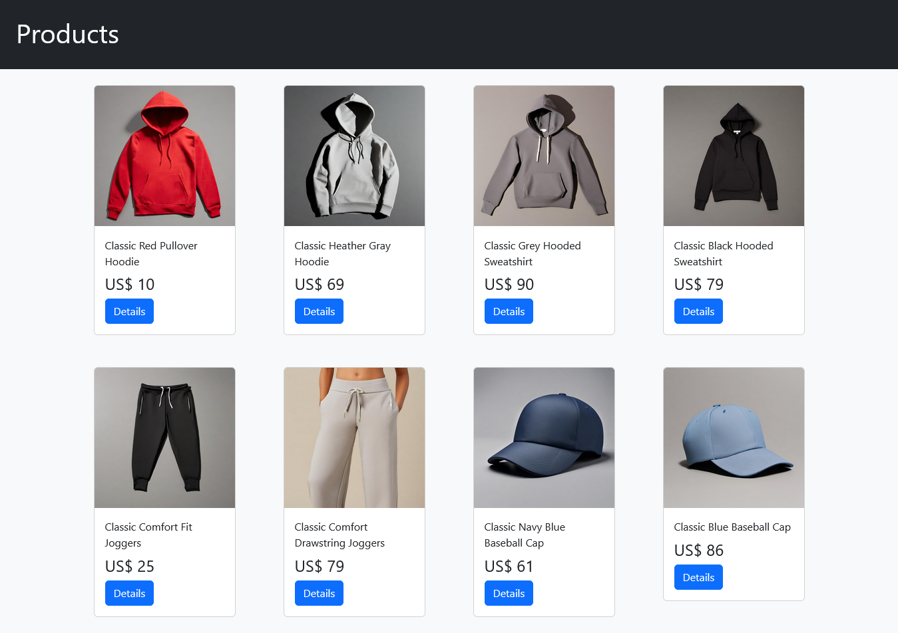

# ProductosAPI
Proyecto en angular para consumir una API de productos y mostrar los productos registrados.

## Consigna
**Desafío:** Consumo de API en Angular

**Objetivo:** Crear una aplicación Angular que consuma datos de una API y los muestre en un componente tipo lista utilizando httpClient y dependency injection.

**Instrucciones:**
* Seleccionar una API: Elige una de las siguientes APIs para consumir datos:
    * Random Person Generator
    * Platzi Fake Store API
    * Fruityvice API
    * PokéAPI
    * The MealDB API

* Crear una nueva aplicación Angular: Utiliza Angular CLI para crear una nueva aplicación Angular.
* Crear un servicio para consumir la API: Genera un servicio utilizando Angular CLI. En el servicio, utiliza httpClient para conectarte a un endpoint de tipo GET que traiga una lista de datos desde la API seleccionada. Deberá ser una lista de datos y no un sólo dato.
* Crear un componente para mostrar los datos: Genera un componente utilizando Angular CLI. En el componente, inyecta el servicio creado y utiliza el método getDatos para obtener los datos y mostrarlos en una lista.
* Mostrar los datos en el template del componente: En el archivo HTML del componente, utiliza directivas de Angular para mostrar los datos en una lista. No hace falta que tenga estilos si aún no los manejas correctamente. Sólo es necesario mostrar los datos. Recuerda que es una lista de datos y no un sólo dato.
* Ejecutar la aplicación: Ejecuta la aplicación y verifica que los datos se muestren correctamente en el componente.
 Sube el código de tu aplicación a un repositorio en GitHub y comparte el enlace.

# ProductosAPI

This project was generated with [Angular CLI](https://github.com/angular/angular-cli) version 18.2.4.

## Development server

Run `ng serve` for a dev server. Navigate to `http://localhost:4200/`. The application will automatically reload if you change any of the source files.

## Code scaffolding

Run `ng generate component component-name` to generate a new component. You can also use `ng generate directive|pipe|service|class|guard|interface|enum|module`.

## Build

Run `ng build` to build the project. The build artifacts will be stored in the `dist/` directory.

## Running unit tests

Run `ng test` to execute the unit tests via [Karma](https://karma-runner.github.io).

## Running end-to-end tests

Run `ng e2e` to execute the end-to-end tests via a platform of your choice. To use this command, you need to first add a package that implements end-to-end testing capabilities.

## Further help

To get more help on the Angular CLI use `ng help` or go check out the [Angular CLI Overview and Command Reference](https://angular.dev/tools/cli) page.
