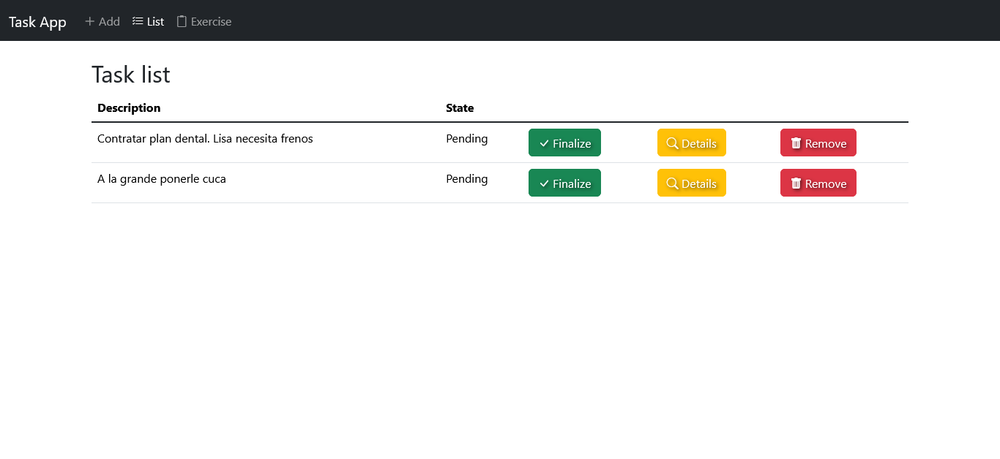

# ToDoList
Proyecto en angular para administrar tareas.

# Consigna
## Desarrollar una Mini App - Lista de Tareas (To-do List)
La mini app será una simple lista de tareas donde los usuarios puedan:
* Ver una lista de tareas con su estado (completada o pendiente).
* Agregar nuevas tareas a la lista.
* Marcar tareas como completadas o eliminarlas.

## Detalles para desarrollar:
* Mostrar un mensaje cuando no haya tareas usando *ngIf.
* Usar *ngFor para iterar sobre la lista de tareas.
* Utilizar Input y Output para la comunicación entre componentes.
* Implementar una clase y una interfaz para representar una tarea.
* Aplicar algunos estilos simples para mejorar la apariencia.

## Estructura de la Mini App:
* Tarea: Un componente que muestra una tarea individual.
* Lista de Tareas: Un componente que muestra todas las tareas usando *ngFor.
* Formulario de Tarea: Un componente donde el usuario puede agregar nuevas tareas.

## Paso a Paso:
* Clase e Interfaz para Tarea: Creamos una clase para representar las tareas y una interfaz para definir su estructura.
* Componente de Tarea: Un componente que recibe una tarea como @Input() y emite un evento con @Output() cuando se marca como completada o se elimina.
* Componente Lista de Tareas: Muestra todas las tareas usando *ngFor, y muestra un mensaje con *ngIf si no hay tareas.
* Componente Formulario de Tarea: Un pequeño formulario donde los usuarios pueden ingresar el título de una nueva tarea.

# ToDoList

This project was generated with [Angular CLI](https://github.com/angular/angular-cli) version 18.2.4.

## Development server

Run `ng serve` for a dev server. Navigate to `http://localhost:4200/`. The application will automatically reload if you change any of the source files.

## Code scaffolding

Run `ng generate component component-name` to generate a new component. You can also use `ng generate directive|pipe|service|class|guard|interface|enum|module`.

## Build

Run `ng build` to build the project. The build artifacts will be stored in the `dist/` directory.

## Running unit tests

Run `ng test` to execute the unit tests via [Karma](https://karma-runner.github.io).

## Running end-to-end tests

Run `ng e2e` to execute the end-to-end tests via a platform of your choice. To use this command, you need to first add a package that implements end-to-end testing capabilities.

## Further help

To get more help on the Angular CLI use `ng help` or go check out the [Angular CLI Overview and Command Reference](https://angular.dev/tools/cli) page.
